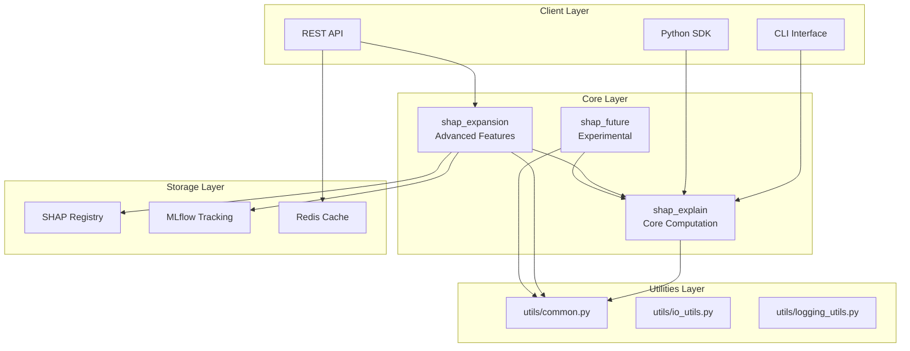
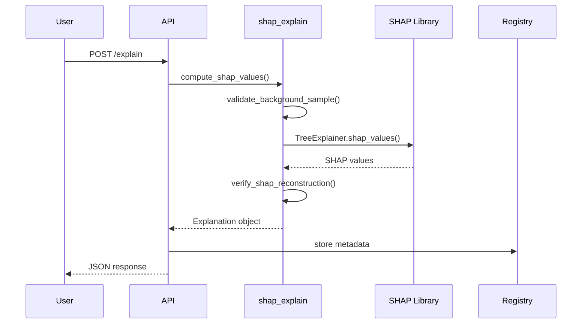
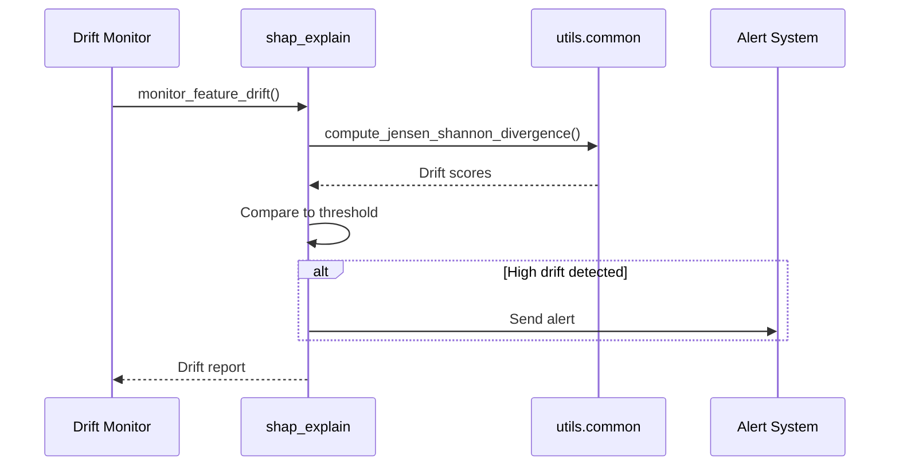
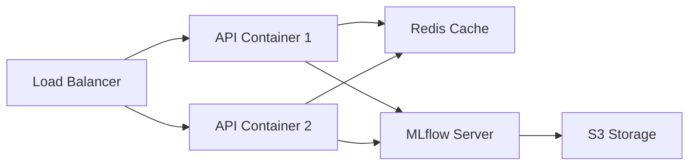

# Architecture Overview

SHAP Analytics follows a modular, layered architecture designed for scalability, maintainability, and production deployment.

## High-Level Architecture



## Module Structure

### 1. shap_explain (Core Module)

**Purpose**: Core SHAP computation and validation logic

**Key Functions**:
- `compute_shap_values()`: Compute SHAP values using TreeExplainer
- `validate_background_sample()`: Validate statistical representativeness
- `monitor_feature_drift()`: Detect data drift using JS divergence
- `verify_shap_reconstruction()`: Verify prediction reconstruction

**Dependencies**:
- `shap`, `sklearn`, `numpy`, `pandas`
- `utils.common` for shared utilities

### 2. shap_expansion (Advanced Features)

**Purpose**: Extended functionality for visualization, API, and deployment

**Key Components**:
- `SHAPRegistry`: Metadata tracking and storage
- `create_interactive_dashboard()`: Plotly-based dashboards
- `serve_shap_api()`: FastAPI REST service
- Async SHAP computation
- Drift detection workflows

**Dependencies**:
- `shap_explain` for core computation
- `fastapi`, `pydantic` for API
- `plotly` for visualization
- `mlflow` for experiment tracking

### 3. shap_future (Experimental)

**Purpose**: Upcoming features and experimental functionality

**Planned Features**:
- Advanced visualization techniques
- Multi-model comparison
- Explainability for deep learning
- Real-time SHAP computation
- Distributed SHAP calculation

### 4. utils (Shared Utilities)

**Purpose**: Common functionality used across all modules

**Submodules**:

#### utils/common.py
- File I/O (JSON, model serialization)
- SHAP utilities (dataframe conversion, mean abs SHAP)
- Statistical functions (Jensen-Shannon divergence)
- Directory management

#### utils/io_utils.py (Planned)
- Advanced data loading/saving
- Format conversion utilities
- Compression support

#### utils/logging_utils.py (Planned)
- LambdaJsonFormatter for structured logging
- Context managers for logging
- Performance profiling

## Data Flow

### SHAP Computation Flow



### Drift Monitoring Flow



## Design Principles

### 1. Separation of Concerns

- **Core computation** (`shap_explain`): Pure computation logic
- **Extensions** (`shap_expansion`): Deployment and advanced features
- **Utilities**: Shared, reusable functionality
- **Future work** (`shap_future`): Isolated experimental features

### 2. Type Safety

- Strict typing with `mypy --strict`
- Type hints for all public functions
- Runtime validation with `pydantic`

### 3. Testability

- Pure functions where possible
- Dependency injection for external services
- Comprehensive test coverage (>80%)
- Fixtures in `conftest.py`

### 4. Extensibility

- Plugin architecture for new explainers
- Registry system for custom metadata
- Hook system for pre/post-processing

### 5. Production Readiness

- Structured JSON logging
- Health check endpoints
- Graceful error handling
- Comprehensive input validation

## Configuration Management

```python
# Using pydantic-settings
from pydantic_settings import BaseSettings

class SHAPConfig(BaseSettings):
    background_size: int = 100
    drift_threshold: float = 0.2
    random_state: int = 42
    api_host: str = "0.0.0.0"
    api_port: int = 8080

    class Config:
        env_file = ".env"
        env_file_encoding = "utf-8"

config = SHAPConfig()
```

## Deployment Architecture

### Docker Deployment



### Components

1. **API Containers**: FastAPI services with SHAP computation
2. **Redis Cache**: Cache for frequently requested explanations
3. **MLflow Server**: Experiment tracking and model registry
4. **S3 Storage**: Persistent storage for models and artifacts

## Error Handling Strategy

```python
from typing import Union
from pydantic import BaseModel

class ErrorResponse(BaseModel):
    error: str
    details: str
    code: int

class SuccessResponse(BaseModel):
    shap_values: list
    metadata: dict

Response = Union[SuccessResponse, ErrorResponse]
```

## Performance Considerations

### Optimization Strategies

1. **Background Sample Caching**: Cache background samples in Redis
2. **Batch Processing**: Process multiple instances together
3. **Async Computation**: Use `asyncio` for I/O-bound operations
4. **Model Caching**: Keep trained models in memory
5. **Result Caching**: Cache SHAP values with TTL

### Benchmarks

| Operation | Time (ms) | Memory (MB) |
|-----------|-----------|-------------|
| Compute SHAP (100 samples) | ~500 | ~50 |
| Validate background | ~50 | ~10 |
| Verify reconstruction | ~10 | ~5 |
| API call (cached) | ~5 | ~2 |
| API call (uncached) | ~550 | ~50 |

## Security Considerations

1. **Input Validation**: Validate all inputs with `pydantic`
2. **API Authentication**: Use API keys for production
3. **Rate Limiting**: Prevent abuse with rate limits
4. **Secrets Management**: Store secrets in `.env` (not in code)
5. **Model Checksums**: Verify model integrity with SHA256

## Monitoring and Observability

### Metrics to Track

- SHAP computation latency (p50, p95, p99)
- API response times
- Cache hit rate
- Drift detection frequency
- Error rates by type

### Logging Structure

```json
{
  "timestamp": "2025-10-31T10:00:00Z",
  "level": "INFO",
  "module": "shap_explain",
  "function": "compute_shap_values",
  "message": "SHAP computation completed",
  "context": {
    "model": "RandomForest",
    "n_samples": 100,
    "background_size": 50,
    "duration_ms": 523
  }
}
```

## Future Enhancements

See [Future Work](future_work.md) for planned architectural improvements.
