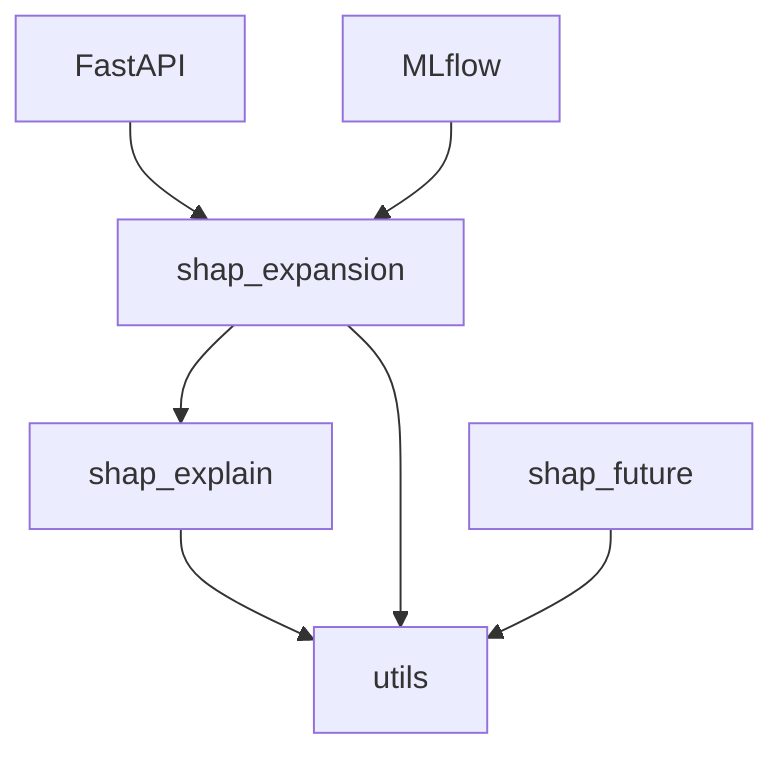

# SHAP Analytics

**Professional SHAP value computation, analysis, and deployment toolkit**

[](https://github.com/yourusername/shap-analytics/actions)
[](https://codecov.io/gh/yourusername/shap-analytics)
[](https://badge.fury.io/py/shap-analytics)
[](https://www.python.org/downloads/)
[](https://opensource.org/licenses/MIT)

## Overview

SHAP Analytics is a comprehensive Python library for computing, analyzing, visualizing, and deploying SHAP (SHapley Additive exPlanations) values in production machine learning systems. It provides robust tools for feature importance analysis, drift monitoring, background sample validation, and automated explanation generation with enterprise-grade quality controls.

## Key Features

- **Core SHAP Computation**: Efficient SHAP value calculation with TreeExplainer support
- **Validation Tools**: Background sample validation and SHAP reconstruction verification
- **Drift Monitoring**: Feature drift detection using Jensen-Shannon divergence
- **Interactive Dashboards**: Create rich visualizations with Plotly integration
- **REST API**: FastAPI-based service for SHAP computation and serving
- **Registry System**: Track and manage SHAP explanations with metadata
- **MLflow Integration**: Experiment tracking and model versioning
- **Type Safety**: Fully typed codebase with mypy strict mode
- **Production Ready**: Docker support, structured logging, comprehensive testing

## Quick Start

### Installation

```bash
# Using Poetry (recommended)
poetry add shap-analytics

# Using pip
pip install shap-analytics
```

### Basic Usage

```python
from shap_analytics import compute_shap_values
from sklearn.ensemble import RandomForestClassifier
from sklearn.datasets import load_breast_cancer
from sklearn.model_selection import train_test_split

# Load data
data = load_breast_cancer(as_frame=True)
X_train, X_test, y_train, y_test = train_test_split(
    data.data, data.target, test_size=0.2, random_state=42
)

# Train model
model = RandomForestClassifier(n_estimators=100, random_state=42)
model.fit(X_train, y_train)

# Compute SHAP values
shap_values = compute_shap_values(model, X_train, X_test)
```

## Architecture

SHAP Analytics follows a modular architecture:



- **shap_explain**: Core SHAP computation and validation
- **shap_expansion**: Advanced utilities, visualization, API
- **shap_future**: Experimental features and future enhancements
- **utils**: Common utilities shared across modules

## Documentation

- [Usage Examples](usage.md)
- [Architecture Overview](architecture.md)
- [API Reference](api_reference.md)
- [Future Work](future_work.md)

## Development

### Requirements

- Python >= 3.10
- Poetry for dependency management
- Docker (optional, for containerization)

### Setup

```bash
# Clone repository
git clone https://github.com/yourusername/shap-analytics.git
cd shap-analytics

# Install dependencies
poetry install

# Install pre-commit hooks
pre-commit install

# Run tests
poetry run pytest -q
```

### Quality Checks

```bash
# Type checking
mypy --strict src/

# Linting
ruff check src/

# Code formatting
ruff format src/

# Run all checks
pre-commit run --all-files
```

## Contributing

We welcome contributions! Please see our [Contributing Guide](CONTRIBUTING.md) for details.

## License

This project is licensed under the MIT License - see the [LICENSE](../LICENSE) file for details.

## Citation

If you use SHAP Analytics in your research, please cite:

```bibtex
@software{shap_analytics_2025,
  title = {SHAP Analytics: Professional SHAP Value Computation and Analysis},
  author = {SHAP Analytics Contributors},
  year = {2025},
  version = {0.1.0},
  url = {https://github.com/yourusername/shap-analytics}
}
```

## Acknowledgments

Built on top of the excellent [SHAP library](https://github.com/slundberg/shap) by Scott Lundberg.
